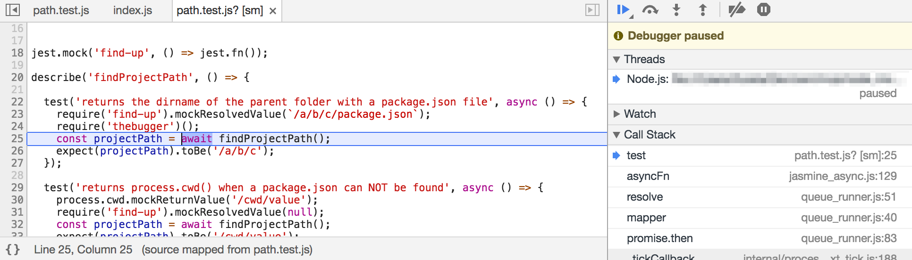

<p>
  
</p>

<p align="center">
  debug a nodejs process without inspect flags.
</p>

# thebugger &middot; [](https://github.com/fabiomcosta/thebugger/blob/master/LICENSE) [](https://badge.fury.io/js/thebugger)

**Note:** works only on node>=8

## The problem

Debugging currently requires proving the main `node` process flags like `--inspect`
and/or `--inspect-brk`.

It works great, but most of the times I don't have full control over the process
flags because I'm executing the process through a wrapper, generally `jest`,
`mocha` or `gulp` and so many others.

Node 8 comes with the `inspector` module, which allows users to programmatically
open an `inspector`.

Calling `inspector` in a blocking way is a bit cumbersome though, that's why
this lib was created.

## Install

Install `thebugger` as a dev dependency:

```
npm i --save-dev thebugger
# or
yarn add --dev thebugger
```

## Usage

Add `thebugger()` to the line of code you want to start debugging, which is
where you'd add a `debugger;` statement.

```js
require('thebugger')();
```

Wait until your nodejs process prints:

```
Debugger listening on ws://127.0.0.1:9222/038a3e89-b497-4558-9709-6a3da5ec3803
For help see https://nodejs.org/en/docs/inspector
```

**Note:** `jest` and other wrappers might not show this message but debugger still
works on them.

Now you can open any Chrome DevTools and click on the green nodejs icon .
After connecting with DevTools, you'll want to click on "step out"  to start debugging your code.

<p>
  
</p>

Further instructions at: https://medium.com/@paul_irish/debugging-node-js-nightlies-with-chrome-devtools-7c4a1b95ae27

You also can use any DevTools frontend of your preference, like `node inspect`.
